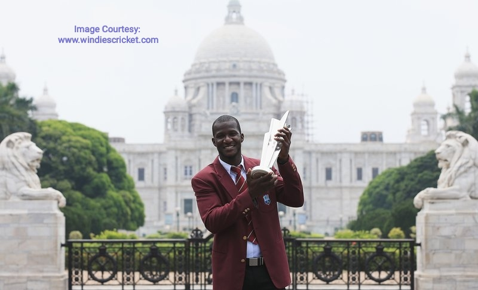

<figure>

<figcaption>

Source: https://www.windiescricket.com/news/daren-sammy-appointed-newest-member-cwi-board-directors/

</figcaption>

</figure>

Former West Indies cricket Captain, Daren Sammy has been appointed as an independent non-member director of the Cricket West Indies (CWI) Board of Directors by the CWI Board at a meeting held last Thursday 17th June 2021. 
  
With international cricket experience of more than 250 matches, Sammy is specially known for leading the West Indies to back-to-back ICC T20 World Cup titles in 2012 and in 2016. Daren is the first international cricketer from St. Lucia to have the National Cricket Stadium named in his honour. He has captained the Windward Islands cricket team in several domestic T20 leagues. Sammy is an awardee of the Order of the British Empire (OBE) by Queen Elizabeth II. He is the current Head Coach of Peshawar Zalmi in the Pakistan Super League and Cricket Consultant for the St. Lucia Zouks in the CPL (Carribbean Premier League).  
  
Sammy’s appointment to the CWI Board of Directors will give a regional expertise and will add a fresh and more youthful perspective.

On Daren Sammy’s appointment to the Board, the CWI President Ricky Skerritt says:  
  
“I am delighted to welcome Daren Sammy as an independent, non-member Director whose role will be to ensure that all the right questions are being asked while contributing to the shaping of new ideas and solutions. Daren’s fairly recent experience as a two-time World Cup winning captain will bring with him a much needed modern-day cricketer’s perspective which should add valuable insights to Board discussions and decision-making. His appointment is testament to our commitment to strengthen CWI’s governance, and to utilize expertise from across all stakeholder groups.”

  
On his new appointment, Sammy said:  
  
“It is an honour to be appointed as a CWI Director; this is another great opportunity for me to give my best to West Indies cricket in a new way, off the field. All my local, regional and international experiences have prepared me to make a significant ongoing impact in West Indies cricket. I am excited and thankful for the chance to serve and look forward to giving back to the sport and region that I love so much.”

Sammy will be joining Trinidadian Attorney Mrs. Debra Coryat-Patton and Jamaican Surgeon and University Administrator, Dr. Akshai Mansingh, who were both re-appointed as the Independent Directors at last Thurday’s CWI Board of Directors’ meeting.
