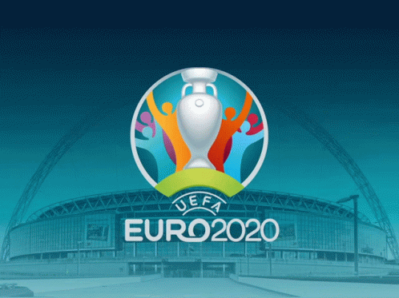

After seeing some stupifying league matchups of the UEFA EURO 2020, we are now heading towards the Round-Of 16 of the European Championship.

The top 2 teams of every group have been qualified for the Round-Of 16 and four out of six best third ranked teams have also been qualified for the RO-16

* * *

The teams which have been qualified for the Round-Of 16 are:

GROUP A - ITALY, WALES, SWITZERLAND

GROUP B - BELGIUM, DENMARK

GROUP C - NETHERLANDS, AUSTRIA, UKRAINE

GROUP D - ENGLAND, CROATIA, CZECH REPUBLIC

GROUP E - SWEDEN, SPAIN

GROUP F - FRANCE, GERMANY, PORTUGAL

* * *

GROUP A STANDINGS

| Teams | Matches | Win | Lost | Draw | Points |
| --- | --- | --- | --- | --- | --- |
| Italy | 3 | 3 | 0 | 0 | 9 |
| Wales | 3 | 1 | 1 | 1 | 4 |
| Switzerland | 3 | 1 | 1 | 1 | 4 |
| Turkey | 3 | 0 | 3 | 3 | 0 |

GROUP B STANDINGS

| Teams | Matches | Win | Lost | Draw | Points |
| --- | --- | --- | --- | --- | --- |
| Belgium | 3 | 3 | 0 | 0 | 9 |
| Denmark | 3 | 1 | 2 | 0 | 3 |
| Finland | 3 | 1 | 2 | 0 | 3 |
| Russia | 3 | 1 | 2 | 0 | 3 |

GROUP C STANDINGS

| Teams | Matches | Win | Lost | Draw | Points |
| --- | --- | --- | --- | --- | --- |
| Netherlands | 3 | 3 | 0 | 0 | 9 |
| Austria | 3 | 2 | 1 | 0 | 6 |
| Ukraine | 3 | 1 | 2 | 0 | 3 |
| North Macedonia | 3 | 0 | 3 | 0 | 0 |

GROUP D STANDINGS

| Teams | Matches | Win | Lost | Draw | Points |
| --- | --- | --- | --- | --- | --- |
| England | 3 | 2 | 0 | 1 | 7 |
| Croatia | 3 | 1 | 1 | 1 | 4 |
| Czech Republic | 3 | 1 | 1 | 1 | 4 |
| Scotland | 3 | 0 | 2 | 1 | 1 |

GROUP E STANDINGS

| Teams | Matches | Win | Lost | Draw | Points |
| --- | --- | --- | --- | --- | --- |
| Sweden | 3 | 2 | 0 | 1 | 7 |
| Spain | 3 | 1 | 0 | 2 | 5 |
| Slovakia | 3 | 1 | 2 | 0 | 3 |
| Poland | 3 | 0 | 2 | 1 | 1 |

GROUP F STANDINGS

| Teams | Matches | Win | Lost | Draw | Points |
| --- | --- | --- | --- | --- | --- |
| France | 3 | 1 | 0 | 2 | 5 |
| Germany | 3 | 1 | 1 | 1 | 4 |
| Portugal | 3 | 1 | 1 | 1 | 4 |
| Hungary | 3 | 0 | 1 | 2 | 2 |

* * *

The Round-Of 16 Matchups are as follows:

WALES vs DENMARK Sat 26 JUNE Johan Cruijff ArenA, Amsterdam

ITALY vs AUSTRIA Sat 26 JUNE Wembley Stadium, London

NETHERLANDS vs Czech Republic Sun 27 JUNE Puskas Arena, Budapest

BELGIUM vs PORTUGAL Sun 27 JUNE La Cartuja Stadium, Seville

CROATIA vs SPAIN Mon 28 JUNE Parken Stadium, Copenhagen

FRANCE vs SWITZERLAND Mon 28 JUNE National Arena Bucharest, Bucharest

ENGLAND vs GERMANY Tue 29 JUNE Wembley Stadium, London

SWEDEN vs UKRAINE Tue 29 JUNE Hampden Park, Glasgow

* * *

Belgium vs Portugal will be a match most of us are looking forward to! The clash of few of the best of the tournament like Ronaldo,Kevin De Bruyne, Romelo Lukaku, Eden Hazard and many more champion players.

Which match are you looking forward for? Do share your views in the comments .
