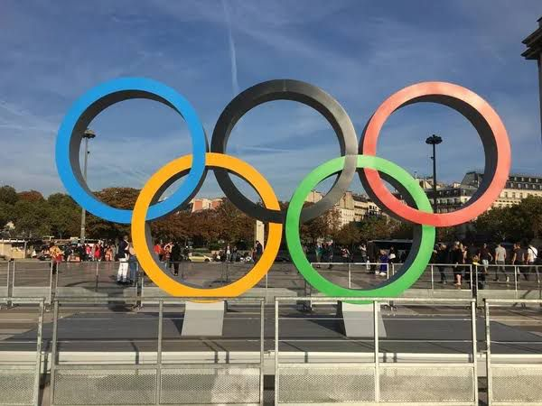

> _**LIGHTNING SPORTS**_
> 
> \- TEJAS KHANNA

The Paris Olympics 2024 are all set to begin with an ecstatic opening ceremony on 26th of July. The 2024 Paris Olympics opening ceremony will be a spectacular celebration of French culture, art, and innovation, setting the stage for a thrilling display of global athletic excellence. With a theme of 'Olympism in Motion,' the ceremony will blend tradition, creativity, and technology to create an unforgettable experience.

It would be an important day for the Indian contingent to start their Olympic race with fresh challenges coming up in sports including '_Hockey, Badminton, Shooting, Boxing_, _Table Tennis and Tennis.'_

* * *

Here is the full schedule of the Indian Contingent for 27th July 2024, Saturday (Day 1)

# **COMPLETE SCHEDULE**

**BADMINTON:**

**_MEN'S SINGLES, GROUP PLAY STAGE (GROUP L) @ 19:10 PM_** 

_LAKSHYA SEN (INDIA) vs KEVIN CORDON (GUA)_

**_MEN'S DOUBLES, GROUP PLAY STAGE (GROUP C) @ 20:00 PM_** 

_CHIRAG SHETTY/SATWIKSAIRAJ RANKIREDDY (INDIA) vs CORVEE/LABAR (FRA)_

_**WOMEN'S DOUBLES, GROUP PLAY STAGE (GROUP C) @ 23:50 PM**_

_ASHWINI PONNAPPA/TANISHA CRASTO (INDIA) vs KIM/KONG (KOR)_

**BOXING:**

**_WOMEN'S 54 KG, PRELIMINARIES - ROUND OF 32 @ 00:02 AM_**

_PREETI (INDIA) vs THI KIM ANH VO (VIE)_

**HOCKEY:**

**_MEN'S TOURNAMENT, POOL MATCHES, POOL B @ 21:00 PM_**

_INDIA vs NEW ZEALAND_

**SHOOTING:**

_**10 m AIR RIFLE MIXED TEAM QUALIFICATION @ 12:30 PM**_

_INDIA 1 : VALARIVAN E/SINGH S_

_INDIA 2 : RAMITA R/ BABUTA A_

_**10m AIR PISTOL MEN'S QUALIFICATIONS @ 14:00 PM**_

_ARJUN SINGH CHEEMA & SARABJOT SINGH_

_**10m AIR PISTOL WOMEN'S QUALIFICATION @ 16:00 PM**_

_MANU BHAKER & RHYTHM SANGWAN_

**TENNIS:**

_**MEN'S DOUBLES FIRST ROUND @ 15:30 PM**_

_BOPANNA/BALAJI (IND) vs REBOUL/ROGER-VASSELIN (FRA)_

**TABLE-TENNIS:**

**_MEN'S SINGLES PRELIMINAY ROUND 1 @ 19:15 PM_**

_HARMEET DESAI (INDIA)  vs ZAID ABO YAMAN (JOR)_

\*All times are in Indian Standard Time (IST)

The Paris Olympic Games 2024 can be live streamed in India from JioCinema and on Sports 18 TV channel.
