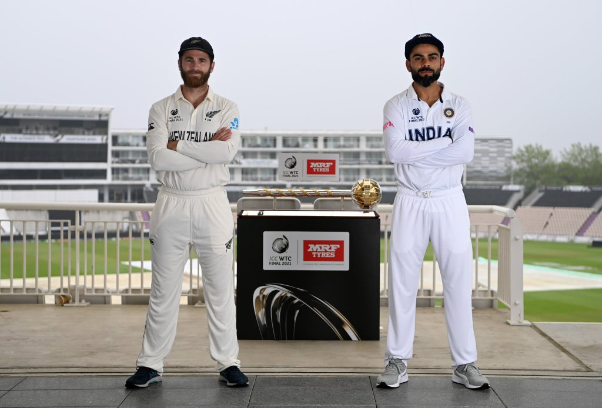
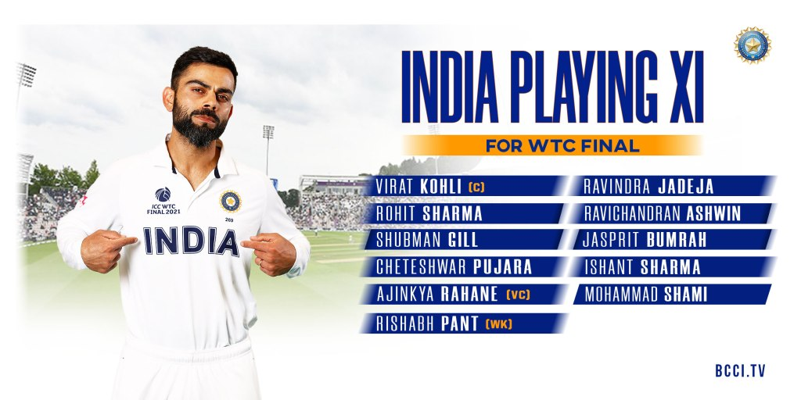
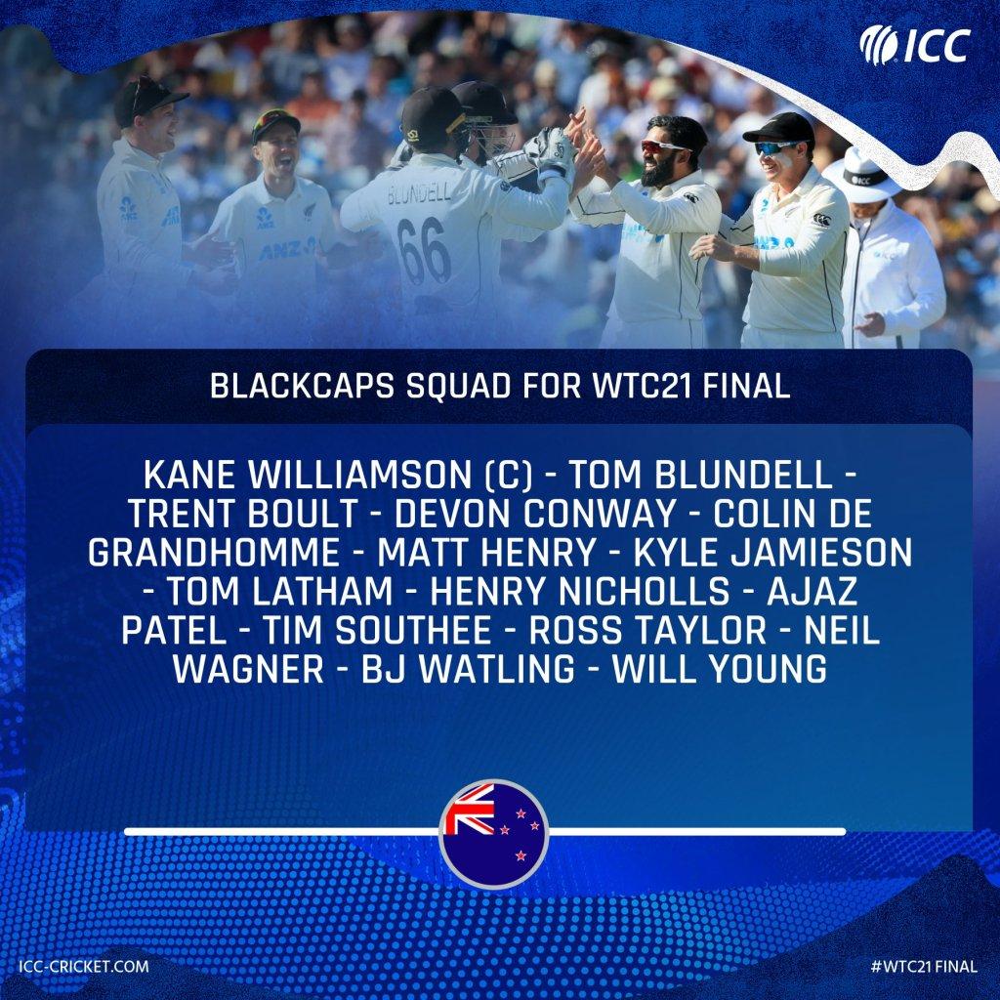

<figure>

<figcaption>

Source: https://twitter.com/BCCI/status/1405591603578736643?s=19

</figcaption>

</figure>

On 17th June , Board of Control for Cricket in India (BCCI) announced the playing 11 of the Indian Team who will be facing New Zealand in the WTC Final from June 18th , in Southampton.

The playing for India is -

Virat Kohli (Captain), Rohit Sharma , Shubhman Gill , Cheteshwar Pujara , Ajinkya Rahane ( Vice-Captain) , Rishabh Pant (Wicket-Keeper), Ravindra Jadeja, Ravichandran Ashwin, Jasprit Bumrah , Mohammed Shami , Ishant Sharma

<figure>

<figcaption>

Source: https://twitter.com/BCCI/status/1405522436850782213?s=19

</figcaption>

</figure>

BCCI announced the 15 men squad on 16th June ,the biggest surprise for Indian fans is that Team India is playing with 3 pacers and 2 spinners .

Mohammed Siraj , Umesh Yadav and Hanuma Vihari will be most missed in the WTC Final.

New Zealand have already announced their 15 men squad for the final.

<figure>

<figcaption>

Source: https://twitter.com/ICC/status/1404655391472902148?s=19

</figcaption>

</figure>

The World Test Championship Final will start at 14:50 PM IST On 18th of June and will be played in The Rose Bowl, Southampton,England and will be aired in India on the Star Sports Network.

Do Comment about which team is your favourite to lift the trophy of the inaugural World Test Championship.
