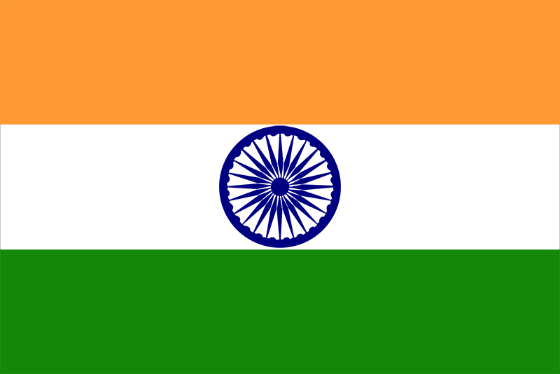

> _**TEJAS KHANNA**_
> 
> LIGHTNING SPORTS

**ARCHERY:**

**_WOMEN'S INDIVIDUALS COMPOUND, OPEN RANKING ROUND @ 5:30 AM_**

_JYOTI BALIYAN (representing India)_

**_MEN'S RECURVE, RANKING ROUND @ 10:30 AM_**

_HARVINDER SINGH & VIVEK CHIKARA (representing India)_

_**MEN'S INDIVIDUAL COMPOUND, RANKING ROUND @ 10:30 AM**_

_RAKESH KUMAR & SHYAM SUNDAR (representing India)_

**_MEN'S TEAM COMPOUND, RANKING ROUND @ 10:30 AM_**

**ATHLETICS:**

_**MEN'S SHOT PUT F55, FINALS @ 3:30 PM**_

_TEK CHAND ( representing India)_

**POWERLIFTING:**

**_WOMEN'S 50kg, FINAL @ 9:30 AM_**

_SAKINA KHATUN (representing India)_

**_MEN'S 65kg, FINAL @ 3:00 PM_**

_JAIDEEP (representing India)_

**TABLE TENNIS:**

**_WOMEN'S SINGLES CLASS 4, ROUND OF 16 @ 7:30 AM_**

_BHAVINA PATEL (INDIA) vs JOYCE DE OLIVEIRA (BRAZIL)_

**_WOMEN'S SINGLES CLASS 4, QUARTERFINALS @ 3:50 PM (updated)_**

_BHAVINA PATEL (INDIA) vs BORISLAVA PERIC RANKOVIC (SERBIA)_
