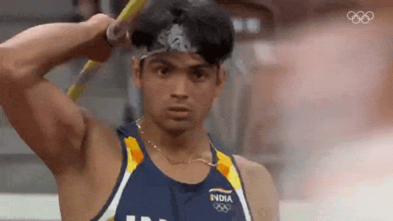

On the last day in Tokyo Olympics 2020 for India, Neeraj Chopra won a 🥇 for India, he threw 87.58 m in his second attempt, which was also his best throw.

Neeraj Chopra has become th **_FIRST_** Indian to win a medal in _**Athletics**_ in the _**Olympics,**_ and just the second _**Indian Individual Gold Medallist**_ after Abhinav Bindra, who won 🥇 in shooting at the 2008 Olympics.

He was congratulated by the whole of India, including Prime Minister Shri Narendra Modi, Defence Minister Shri Rajnath Singh, and former athletes like Anju Bobby George and many more.

So far India has won #7 seven 🏅 including 1 🥇, 2 🥈and 4🥉. India does not have any matchups on the last day at the Olympics. So, India closes it's Tokyo 2020 journey with the best outcome till date, after getting #6 medals at the 2012 London Olympics.

And India end it's #TokyoOlympics journey with a positive note, the best performance India in the #Olympics, and probably the best day even.  
Aditi Ashok finishing on 4th position, Bajrang Punia  winning 🥉and Neeraj Chopra winning 🥇.  
Congratulations 🎊 from our side to all the Indian Athletes who represented India in the #TokyoOlympics2020.
