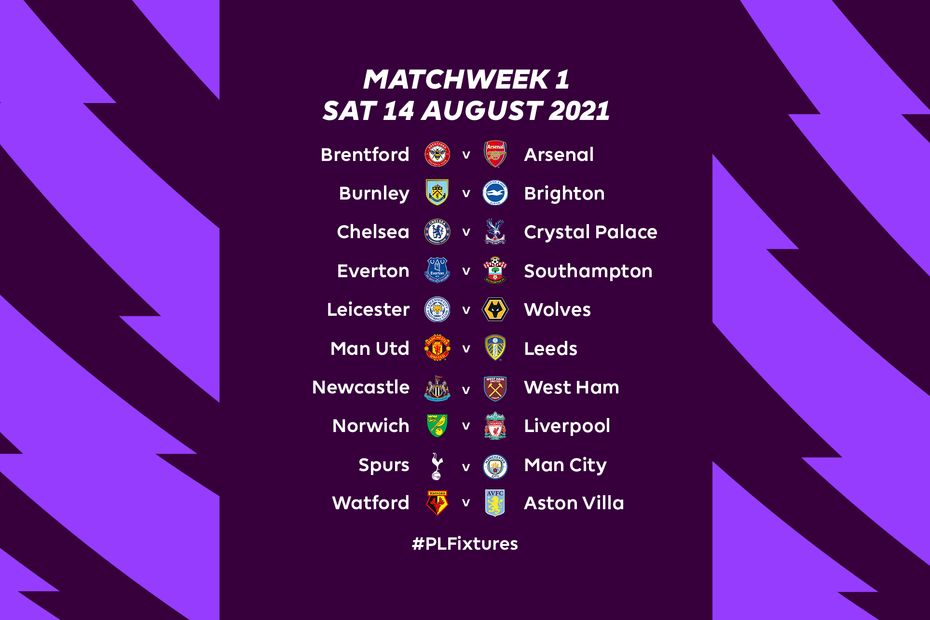

##### 16 Jun 2021

Manchester City ended the 2020/21 season by winning their fifth Premier League Title and seventh English Title with three matches to spare .

On 16th June , all the 380 fixtures for the Premier League season 2021/22 have been released . The season will kickoff from 14th August,2021 continuing till 22nd May,2022.

<figure>

<figcaption>

Source : https://www.premierleague.com/news/2171434

</figcaption>

</figure>

###### Saturday 14 August

Brentford v Arsenal  
Burnley v Brighton  
Chelsea v Crystal Palace  
Everton v Southampton  
Leicester v Wolves  
Man Utd v Leeds  
Newcastle v West Ham  
Norwich v Liverpool  
Spurs v Man City  
Watford v Aston Villa

###### Saturday 21 August

Arsenal v Chelsea  
Aston Villa v Newcastle  
Brighton v Watford  
Crystal Palace v Brentford  
Leeds v Everton  
Liverpool v Burnley  
Man City v Norwich  
Southampton v Man Utd  
West Ham v Leicester  
Wolves v Spurs

###### Saturday 28 August

Aston Villa v Brentford  
Brighton v Everton  
Burnley v Leeds  
Liverpool v Chelsea  
Man City v Arsenal  
Newcastle v Southampton  
Norwich v Leicester  
Spurs v Watford  
West Ham v Crystal Palace  
Wolves v Man Utd

###### Saturday 11 September

Arsenal v Norwich  
Brentford v Brighton  
Chelsea v Aston Villa  
Crystal Palace v Spurs  
Everton v Burnley  
Leeds v Liverpool  
Leicester v Man City  
Man Utd v Newcastle  
Southampton v West Ham  
Watford v Wolves

###### Saturday 18 September

Aston Villa v Everton  
Brighton v Leicester  
Burnley v Arsenal  
Liverpool v Crystal Palace  
Man City v Southampton  
Newcastle v Leeds  
Norwich v Watford  
Spurs v Chelsea  
West Ham v Man Utd  
Wolves v Brentford

###### Saturday 25 September

Arsenal v Spurs  
Brentford v Liverpool  
Chelsea v Man City  
Crystal Palace v Brighton  
Everton v Norwich  
Leeds v West Ham  
Leicester v Burnley  
Man Utd v Aston Villa  
Southampton v Wolves  
Watford v Newcastle

###### Saturday 2 October

Brighton v Arsenal  
Burnley v Norwich  
Chelsea v Southampton  
Crystal Palace v Leicester  
Leeds v Watford  
Liverpool v Man City  
Man Utd v Everton  
Spurs v Aston Villa  
West Ham v Brentford  
Wolves v Newcastle

###### Saturday 16 October

Arsenal v Crystal Palace  
Aston Villa v Wolves  
Brentford v Chelsea  
Everton v West Ham  
Leicester v Man Utd  
Man City v Burnley  
Newcastle v Spurs  
Norwich v Brighton  
Southampton v Leeds  
Watford v Liverpool

###### Saturday 23 October

Arsenal v Aston Villa  
Brentford v Leicester  
Brighton v Man City  
Chelsea v Norwich  
Crystal Palace v Newcastle  
Everton v Watford  
Leeds v Wolves  
Man Utd v Liverpool  
Southampton v Burnley  
West Ham v Spurs

###### Saturday 30 October

Aston Villa v West Ham  
Burnley v Brentford  
Leicester v Arsenal  
Liverpool v Brighton  
Man City v Crystal Palace  
Newcastle v Chelsea  
Norwich v Leeds  
Spurs v Man Utd  
Watford v Southampton  
Wolves v Everton

###### Saturday 6 November

Arsenal v Watford  
Brentford v Norwich  
Brighton v Newcastle  
Chelsea v Burnley  
Crystal Palace v Wolves  
Everton v Spurs  
Leeds v Leicester  
Man Utd v Man City  
Southampton v Aston Villa  
West Ham v Liverpool

###### Saturday 20 November

Aston Villa v Brighton  
Burnley v Crystal Palace  
Leicester v Chelsea  
Liverpool v Arsenal  
Man City v Everton  
Newcastle v Brentford  
Norwich v Southampton  
Spurs v Leeds  
Watford v Man Utd  
Wolves v West Ham

###### Saturday 27 November

Arsenal v Newcastle  
Brentford v Everton  
Brighton v Leeds  
Burnley v Spurs  
Chelsea v Man Utd  
Crystal Palace v Aston Villa  
Leicester v Watford  
Liverpool v Southampton  
Man City v West Ham  
Norwich v Wolves

###### Tuesday 30 November

19:45 Aston Villa v Man City  
19:45 Everton v Liverpool  
19:45 Leeds v Crystal Palace  
19:45 Watford v Chelsea  
19:45 West Ham v Brighton  
19:45 Wolves v Burnley  
20:00 Man Utd v Arsenal

###### Wednesday 1 December

19:45 Newcastle v Norwich  
19:45 Southampton v Leicester  
19:45 Spurs v Brentford

###### Saturday 4 December

Aston Villa v Leicester  
Everton v Arsenal  
Leeds v Brentford  
Man Utd v Crystal Palace  
Newcastle v Burnley  
Southampton v Brighton  
Spurs v Norwich  
Watford v Man City  
West Ham v Chelsea  
Wolves v Liverpool

###### Saturday 11 December

Arsenal v Southampton  
Brentford v Watford  
Brighton v Spurs  
Burnley v West Ham  
Chelsea v Leeds  
Crystal Palace v Everton  
Leicester v Newcastle  
Liverpool v Aston Villa  
Man City v Wolves  
Norwich v Man Utd

###### Tuesday 14 December

19:45 Arsenal v West Ham  
19:45 Brentford v Man Utd  
19:45 Brighton v Wolves  
19:45 Burnley v Watford  
19:45 Leicester v Spurs  
19:45 Norwich v Aston Villa  
20:00 Crystal Palace v Southampton

###### Wednesday 15 December

20:00 Chelsea v Everton  
20:00 Liverpool v Newcastle  
20:00 Man City v Leeds

###### Saturday 18 December

Aston Villa v Burnley  
Everton v Leicester  
Leeds v Arsenal  
Man Utd v Brighton  
Newcastle v Man City  
Southampton v Brentford  
Spurs v Liverpool  
Watford v Crystal Palace  
West Ham v Norwich  
Wolves v Chelsea

###### Saturday 26 December

Aston Villa v Chelsea  
Brighton v Brentford  
Burnley v Everton  
Liverpool v Leeds  
Man City v Leicester  
Newcastle v Man Utd  
Norwich v Arsenal  
Spurs v Crystal Palace  
West Ham v Southampton  
Wolves v Watford

###### Tuesday 28 December

Arsenal v Wolves  
Brentford v Man City  
Chelsea v Brighton  
Crystal Palace v Norwich   
Everton v Newcastle   
Leeds v Aston Villa  
Leicester v Liverpool  
Man Utd v Burnley  
Southampton v Spurs  
Watford v West Ham

###### Saturday 1 January

Arsenal v Man City  
Brentford v Aston Villa  
Chelsea v Liverpool  
Crystal Palace v West Ham  
Everton v Brighton  
Leeds v Burnley  
Leicester v Norwich   
Man Utd v Wolves  
Southampton v Newcastle  
Watford v Spurs

###### Saturday 15 January

Aston Villa v Man Utd  
Brighton v Crystal Palace  
Burnley v Leicester  
Liverpool v Brentford  
Man City v Chelsea  
Newcastle v Watford  
Norwich v Everton  
Spurs v Arsenal  
West Ham v Leeds  
Wolves v Southampton

###### Saturday 22 January

Arsenal v Burnley  
Brentford v Wolves  
Chelsea v Spurs  
Crystal Palace v Liverpool  
Everton v Aston Villa  
Leeds v Newcastle  
Leicester v Brighton  
Man Utd v West Ham  
Southampton v Man City  
Watford v Norwich

###### Tuesday 8 February

19:45 Aston Villa v Leeds  
19:45 Brighton v Chelsea  
19:45 Burnley v Man Utd  
19:45 Norwich v Crystal Palace  
19:45 West Ham v Watford  
19:45 Wolves v Arsenal

###### Wednesday 9 February

19:45 Newcastle v Everton  
19:45 Spurs v Southampton  
20:00 Liverpool v Leicester  
20:00 Man City v Brentford

###### Saturday 12 February

Brentford v Crystal Palace  
Burnley v Liverpool  
Chelsea v Arsenal  
Everton v Leeds  
Leicester v West Ham  
Man Utd v Southampton  
Newcastle v Aston Villa  
Norwich v Man City  
Spurs v Wolves  
Watford v Brighton

###### Saturday 19 February

Arsenal v Brentford  
Aston Villa v Watford  
Brighton v Burnley  
Crystal Palace v Chelsea  
Leeds v Man Utd  
Liverpool v Norwich  
Man City v Spurs  
Southampton v Everton  
West Ham v Newcastle  
Wolves v Leicester

###### Saturday 26 February

Arsenal v Liverpool  
Brentford v Newcastle  
Brighton v Aston Villa  
Chelsea v Leicester  
Crystal Palace v Burnley  
Everton v Man City  
Leeds v Spurs  
Man Utd v Watford  
Southampton v Norwich  
West Ham v Wolves

###### Saturday 5 March

Aston Villa v Southampton  
Burnley v Chelsea  
Leicester v Leeds  
Liverpool v West Ham  
Man City v Man Utd  
Newcastle v Brighton  
Norwich v Brentford  
Spurs v Everton  
Watford v Arsenal  
Wolves v Crystal Palace

###### Saturday 12 March

Arsenal v Leicester  
Brentford v Burnley  
Brighton v Liverpool  
Chelsea v Newcastle  
Crystal Palace v Man City  
Everton v Wolves  
Leeds v Norwich  
Man Utd v Spurs  
Southampton v Watford  
West Ham v Aston Villa

###### Saturday 19 March

Aston Villa v Arsenal  
Burnley v Southampton  
Leicester v Brentford  
Liverpool v Man Utd  
Man City v Brighton  
Newcastle v Crystal Palace  
Norwich v Chelsea  
Spurs v West Ham  
Watford v Everton  
Wolves v Leeds

###### Saturday 2 April

Brighton v Norwich  
Burnley v Man City  
Chelsea v Brentford  
Crystal Palace v Arsenal  
Leeds v Southampton  
Liverpool v Watford  
Man Utd v Leicester  
Spurs v Newcastle  
West Ham v Everton  
Wolves v Aston Villa

###### Saturday 9 April

Arsenal v Brighton  
Aston Villa v Spurs  
Brentford v West Ham  
Everton v Man Utd  
Leicester v Crystal Palace  
Man City v Liverpool  
Newcastle v Wolves  
Norwich v Burnley  
Southampton v Chelsea  
Watford v Leeds

###### Saturday 16 April

Aston Villa v Liverpool  
Everton v Crystal Palace  
Leeds v Chelsea  
Man Utd v Norwich  
Newcastle v Leicester  
Southampton v Arsenal  
Spurs v Brighton  
Watford v Brentford  
West Ham v Burnley  
Wolves v Man City

###### Saturday 23 April

Arsenal v Man Utd  
Brentford v Spurs  
Brighton v Southampton  
Burnley v Wolves  
Chelsea v West Ham  
Crystal Palace v Leeds  
Leicester v Aston Villa  
Liverpool v Everton  
Man City v Watford  
Norwich v Newcastle

###### Saturday 30 April

Aston Villa v Norwich  
Everton v Chelsea  
Leeds v Man City  
Man Utd v Brentford  
Newcastle v Liverpool  
Southampton v Crystal Palace  
Spurs v Leicester  
Watford v Burnley  
West Ham v Arsenal  
Wolves v Brighton

###### Saturday 7 May

Arsenal v Leeds  
Brentford v Southampton  
Brighton v Man Utd  
Burnley v Aston Villa  
Chelsea v Wolves  
Crystal Palace v Watford  
Leicester v Everton  
Liverpool v Spurs  
Man City v Newcastle  
Norwich v West Ham

###### Sunday 15 May

Aston Villa v Crystal Palace  
Everton v Brentford  
Leeds v Brighton  
Man Utd v Chelsea  
Newcastle v Arsenal  
Southampton v Liverpool  
Spurs v Burnley  
Watford v Leicester  
West Ham v Man City  
Wolves v Norwich

###### Sunday 22 May

16:00 Arsenal v Everton  
16:00 Brentford v Leeds  
16:00 Brighton v West Ham  
16:00 Burnley v Newcastle  
16:00 Chelsea v Watford  
16:00 Crystal Palace v Man Utd  
16:00 Leicester v Southampton  
16:00 Liverpool v Wolves  
16:00 Man City v Aston Villa  
16:00 Norwich v Spurs

Hoping for an exciting season!

Rate us!

★
